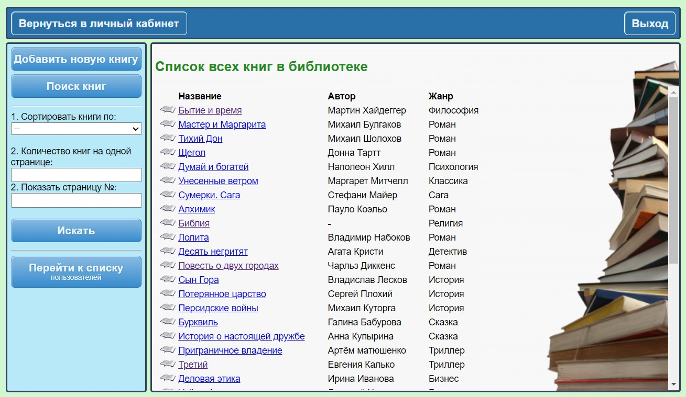

# Library

**Library** - это сайт библиотеки, на котором пользователь может находить и бронировать нужные книги. И затем получать их на руки в библиотеке. Библиотекарь может выдавать книги зарегистрированным пользователям и получать их обратно. И имеет полную информацию: кто, когда и какую книгу забронировал/взял на руки.

***Стек технологий проекта:***   
:white_check_mark: Spring Boot;   
:white_check_mark: Spring Security;   
:white_check_mark: PostgreSQL;   
:white_check_mark: Hibernate;   
:white_check_mark: Maven;   
:white_check_mark: Thymeleaf;   
:white_check_mark: Flyway.

Приложение имеет оформленный интерфейс и развёрнуто на heroku.com. Ссылка для входа: https://libraryapply.herokuapp.com/hello   
(если сервер спит, то перейдя по ссылке надо подождать 10-15сек).

### Описание и детали:
>*- Настроена __Регистрация, аутентификация и авторизация__ пользователей;*  
*- Шифрование паролей - __BCrypt__ password encoder;*   
*- Защита от меж сайтовой подделки запросов - __CSRF-token__;*  
*- Динамическое отображение страниц - __Thymeleaf__;*  
*- Миграция БД - __Flyway__.*   
*- Валидация данных - __Hibernate validator__ и __Spring validator__.*   
*- Бронь на книгах обновляется автоматически в отдельном потоке.*   
*- Реализованы пагинация, сортировка и поиск книг.*   
*- __Lombok__, __Modelmapper__ и т.д.*

| ***Описание и детали:***  |
|:-------------------------:|
|Реализованы пагинация, сортировка и поиск книг|
|      Проверка связи       |
|  |
|      Проверка связи       |
|  |
