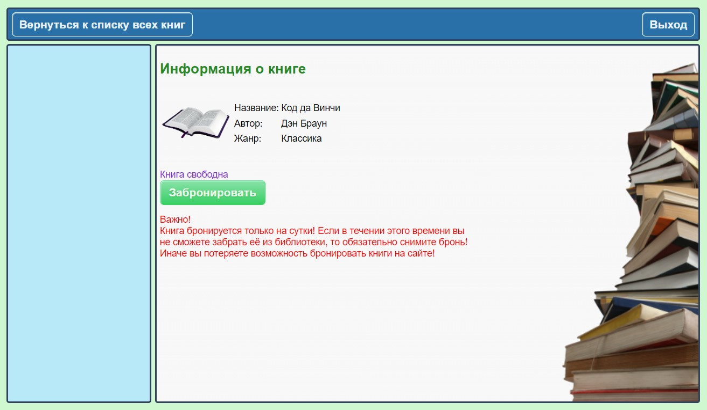
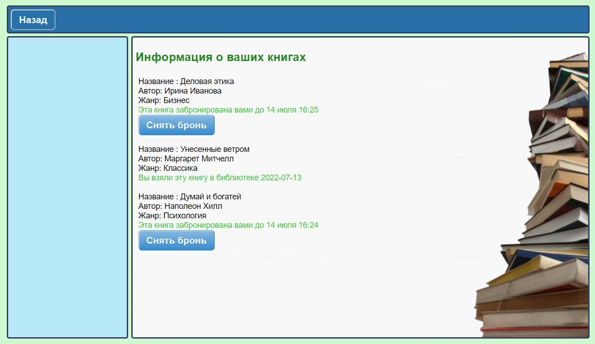
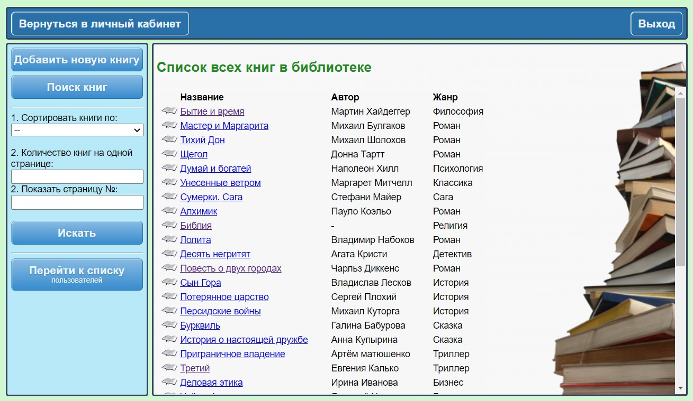
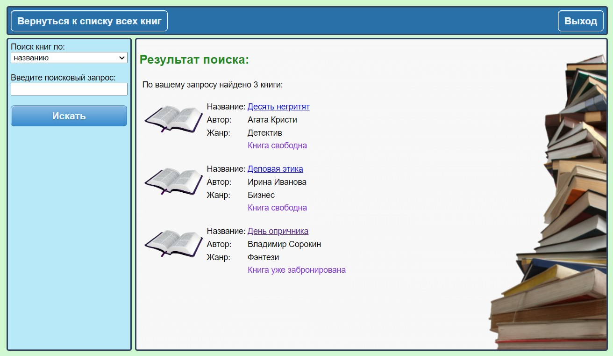
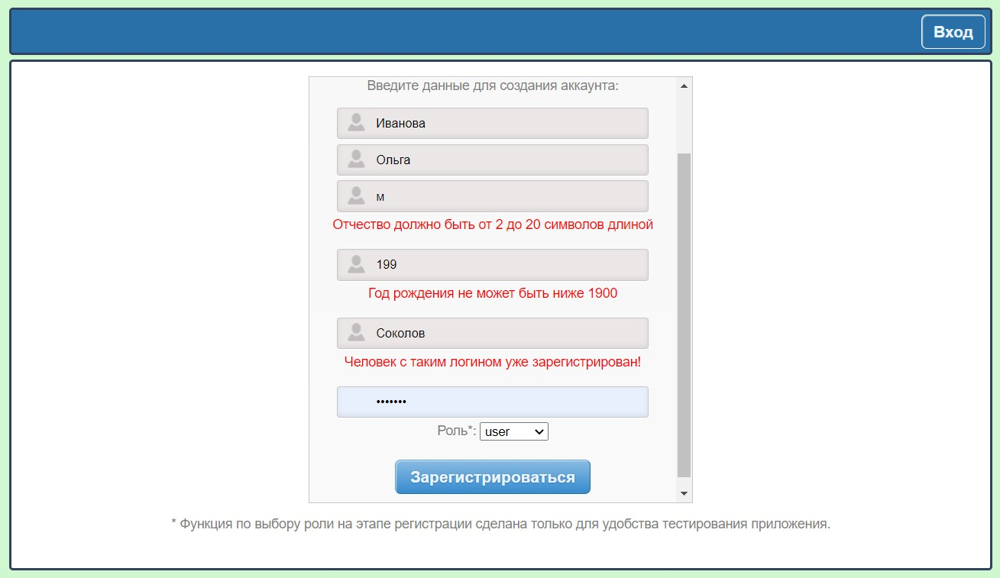
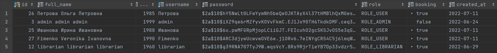
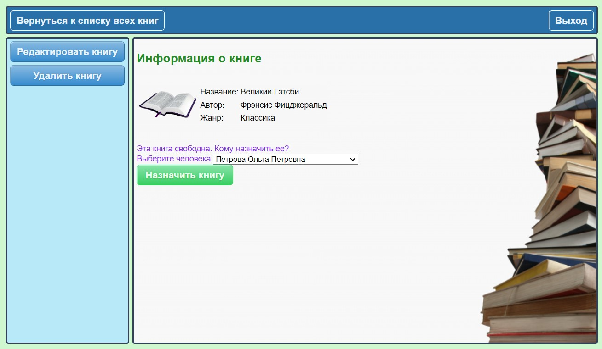
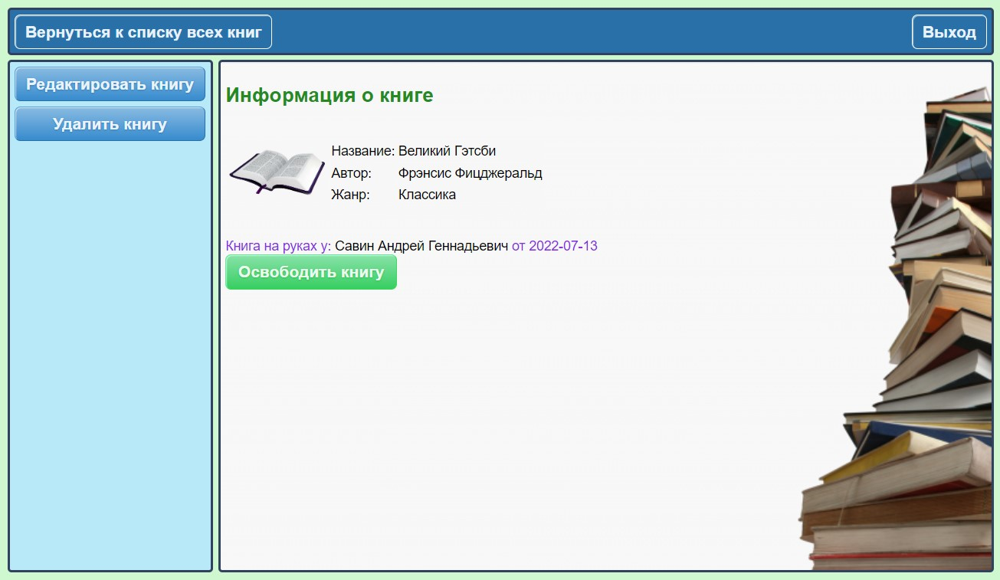
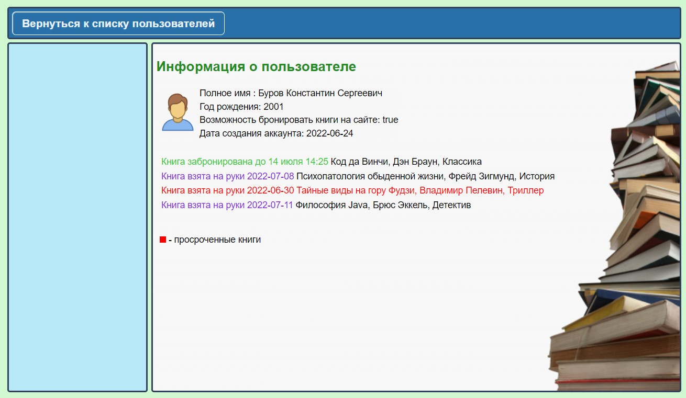
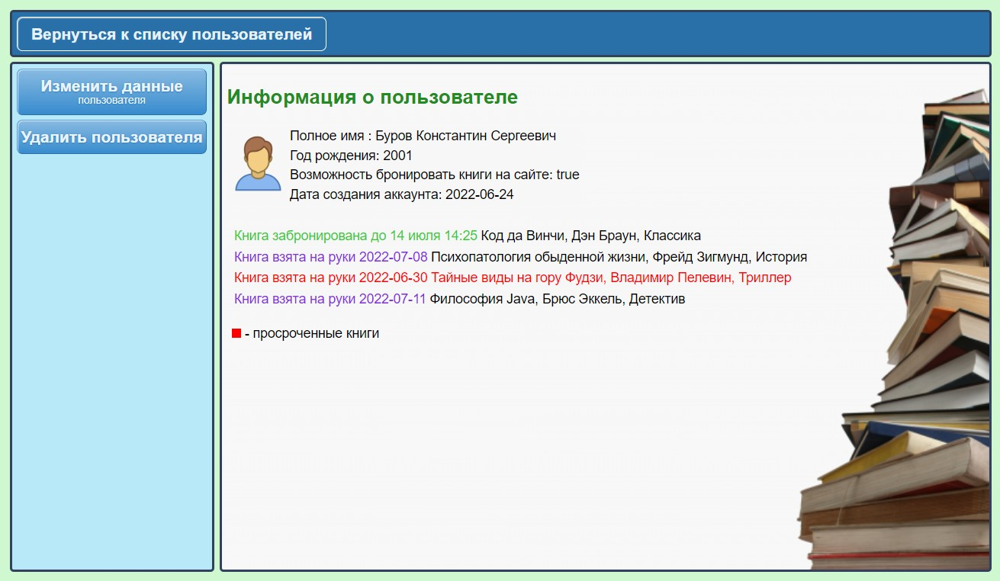

# Library

**Library** - это сайт библиотеки, на котором пользователь может находить и бронировать нужные книги. И затем получать их на руки в библиотеке. Библиотекарь может выдавать книги зарегистрированным пользователям и получать их обратно. И имеет полную информацию: кто, когда и какую книгу забронировал/взял на руки.

***Стек технологий проекта:***   
:white_check_mark: Spring Boot;   
:white_check_mark: Spring Security;   
:white_check_mark: PostgreSQL;   
:white_check_mark: Hibernate;   
:white_check_mark: Maven;   
:white_check_mark: Thymeleaf;   
:white_check_mark: Flyway.

Приложение имеет оформленный интерфейс и развёрнуто на heroku.com. Ссылка для входа: https://libraryapply.herokuapp.com/hello   
(если сервер спит, то перейдя по ссылке надо подождать 10-15сек).

### Функционал:
|                                                                          | USER | LIBRARIAN | ADMIN |
|:------------------------------------------------------------------------:|:----:|:---------:|:-----:|
|   Бронирование книг и отчётность по ним в личном кабинете (скрин 1, 2)   |  +   |     -     |   -   |
|            Доступ к просмотру всех книг библиотеки (скрин 4)             |  +   |     +     |   +   |
|    Редактировать свой профиль (ФИО, год рождения, username, password)    |  +   |     +     |   +   |
|    Выдавать книги пользователям и принимать их обратно (скрин 9, 10)     |  -   |     +     |   +   |
|                 Добавлять, редактировать и удалять книги                 |  -   |     +     |   +   |
| Доступ к просмотру информации о пользователях и их книгах (скрин 11, 12) |  -   |     +     |   +   |
|     Редактировать все данные пользователей кроме username и password     |  -   |     -     |   +   |
|       Вернуть пользователю возможность бронировать книги на сайте        |  -   |     -     |   +   |
|                              Изменять роли                               |  -   |     -     |   +   |

### Описание и детали:
>*- Настроена __Регистрация, аутентификация и авторизация__ пользователей (скрин 3);*  
*- Реализованы пагинация, сортировка и поиск книг (скрины 4-6).*   
*- Валидация данных - __Hibernate validator__ и __Spring validator__ (скрин 7).*   
*- Шифрование паролей - __BCrypt__ password encoder (скрин 8);*   
*- Защита от меж сайтовой подделки запросов - __CSRF-token__;*  
*- Динамическое отображение страниц - __Thymeleaf__;*  
*- Миграция БД - __Flyway__.*   
*- Бронь на книгах обновляется автоматически в отдельном потоке.*   
*- __Lombok__, __Modelmapper__ и т.д.*

|                             1. Бронирование книг:                             |
|:-----------------------------------------------------------------------------:|
|                                                 |
|                  2. Отчётность по книгам в личном кабинете:                   |
|                                                |
| 3. Настроена __регистрация, аутентификация__ и __авторизация__ пользователей: |
|                                                |
|                        4. Пагинация и сортировка книг:                        |
|                                               |
|             5. Поиск книг на сайте. Вид из кабинета библиотекаря:             |
|                                   |
|             6. Поиск книг на сайте. Вид из кабинета пользователя:             |
|                                        |
|     7. Валидация данных - __Hibernate validator__ и __Spring validator__:     |
|                                               |
|             8. Шифрование паролей - __BCrypt__ password encoder:              |
|                                                  |
|                   9. Выдать книгу пользователю - назначить:                   |
|                                                  |
|            10. Забрать книгу у пользователя обратно - освободить:             |
|                                                 |
|   11. Информация о пользователе и его книгах. Вид из кабинета библиотекаря:   |
|                                |
|      12. Информация о пользователе и его книгах. Вид из кабинета админа:      |
|                                    |