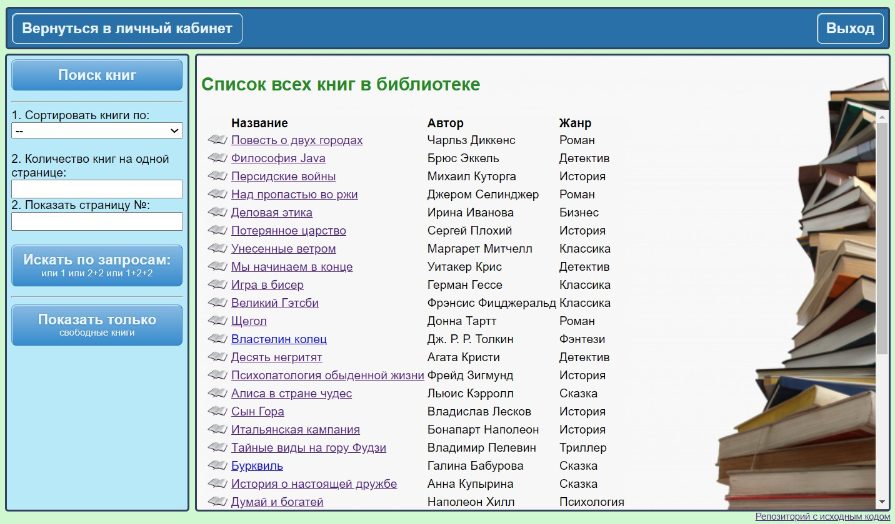
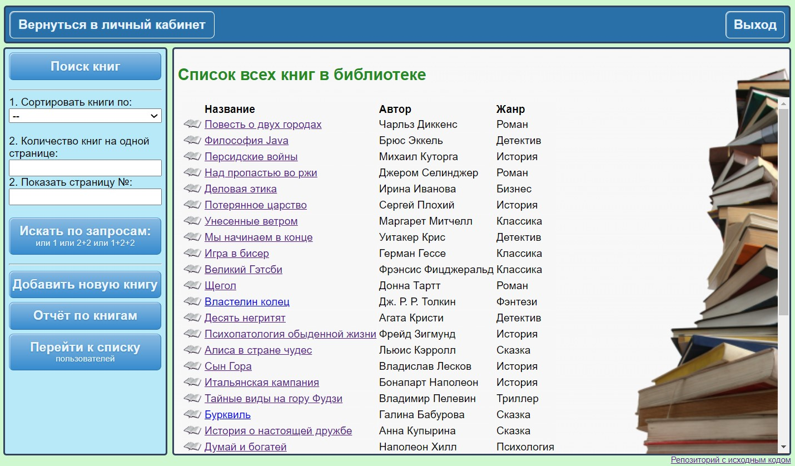

# Library

**Library** - это сайт библиотеки, на котором пользователь может находить и бронировать нужные книги. И затем получать их на руки в библиотеке. Библиотекарь может выдавать книги зарегистрированным пользователям и получать их обратно. И имеет полную информацию: кто, когда и какую книгу забронировал/взял на руки.

***Стек технологий проекта:***   
:white_check_mark: Spring Boot;   
:white_check_mark: Spring Security;   
:white_check_mark: PostgreSQL;   
:white_check_mark: Hibernate;   
:white_check_mark: Maven;   
:white_check_mark: Thymeleaf;   
:white_check_mark: Flyway.

Приложение имеет оформленный интерфейс и развёрнуто на heroku.com. Ссылка для входа: https://libraryapply.herokuapp.com/hello   
(если сервер спит, то перейдя по ссылке надо подождать 10-15сек).

### Функционал:
|                                                                      | USER | LIBRARIAN | ADMIN |
|:--------------------------------------------------------------------:|:----:|:---------:|:-----:|
| Бронирование книг и отчётность по ним в личном кабинете (скрин 1, 2) |  +   |     -     |   -   |
|         Доступ к просмотру всех книг библиотеки (скрин 4, 5)         |  +   |     +     |   +   |
|  Редактировать свой профиль (ФИО, год рождения, username, password)  |  +   |     +     |   +   |
|  Выдавать книги пользователям и принимать их обратно (скрин 10, 11)  |  -   |     +     |   +   |
|               Добавлять, редактировать и удалять книги               |  -   |     +     |   +   |
|    Просмотр информации о пользователях и их книгах (скрин 12, 13)    |  -   |     +     |   +   |
|   Редактировать все данные пользователей кроме username и password   |  -   |     -     |   +   |
|     Вернуть пользователю возможность бронировать книги на сайте      |  -   |     -     |   +   |
|                            Изменять роли                             |  -   |     -     |   +   |

### Описание и детали:
>*- Настроена __Регистрация, аутентификация и авторизация__ пользователей (скрин 3);*  
*- Реализованы пагинация, сортировка и поиск книг (скрины 4-7).*   
*- Валидация данных - __Hibernate validator__ и __Spring validator__ (скрин 8).*   
*- Шифрование паролей - __BCrypt__ password encoder (скрин 9);*   
*- Защита от меж сайтовой подделки запросов - __CSRF-token__;*  
*- Динамическое отображение страниц - __Thymeleaf__ (скрин 14);*  
*- Миграция БД - __Flyway__.*   
*- Бронь на книгах обновляется автоматически в отдельном потоке (скрин 15).*     
*- __Lombok__, __Modelmapper__ и т.д.*

|                             1. Бронирование книг:                             |
|:-----------------------------------------------------------------------------:|
|                                                 |
|                  2. Отчётность по книгам в личном кабинете:                   |
|                                                |
| 3. Настроена __регистрация, аутентификация__ и __авторизация__ пользователей: |
|                                                |
|  4. Список всех книг + пагинация и сортировка. Вид из кабинета пользователя:  |
|                                     |
|  5. Список всех книг + пагинация и сортировка. Вид из кабинета библиотекаря:  |
|                                |
|             6. Поиск книг на сайте. Вид из кабинета библиотекаря:             |
|                                   |
|             7. Поиск книг на сайте. Вид из кабинета пользователя:             |
|                                        |
|     8. Валидация данных - __Hibernate validator__ и __Spring validator__:     |
|                                               |
|             9. Шифрование паролей - __BCrypt__ password encoder:              |
|                                                  |
|                  10. Выдать книгу пользователю - назначить:                   |
|                                                  |
|            11. Забрать книгу у пользователя обратно - освободить:             |
|                                                 |
|   12. Информация о пользователе и его книгах. Вид из кабинета библиотекаря:   |
|                                |
|      13. Информация о пользователе и его книгах. Вид из кабинета админа:      |
|                                    |
|       14. Для динамического отображение страниц используется Thymeleaf:       |
|                                               |
|   15. Обновление брони на книгах и возможности бронировать у пользователей:   |
|                          |